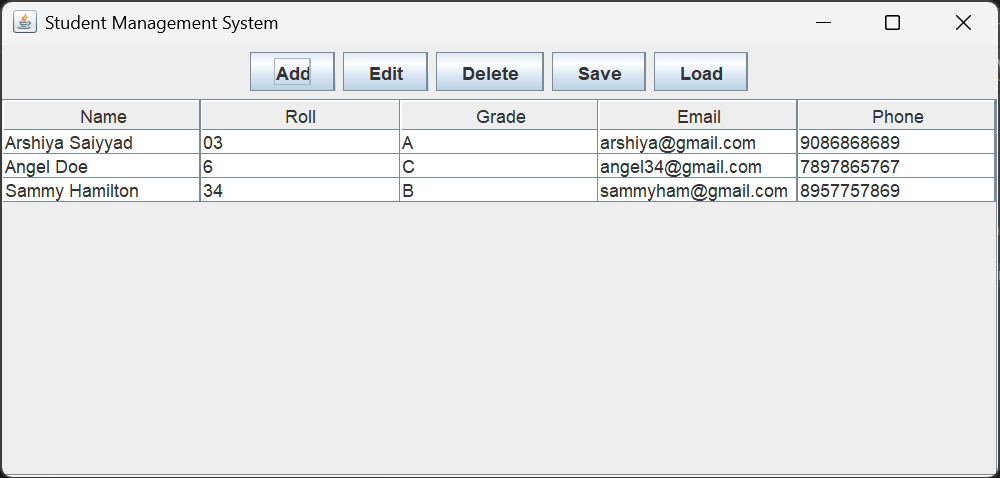

#  Student Management System 

## Overview
The **Student Management System** is a Java-based desktop application. It provides an easy-to-use interface to manage student records, featuring **Add, Edit, Delete, Search, and Display** functionalities with persistent storage.

---

## Features
-  Add new students with details (Name, Roll Number, Grade, Email, Phone).
-  Edit existing student information.
-  Remove student records.
-  Search students by Roll Number.
-  Display all students in a tabular format.
-  Save & Load data from a **CSV file**.
-  Input validation to ensure correct data entry.
-  User-friendly **GUI (Swing)** design.

---

## 🛠️ Technologies Used
- **Java (JDK 8+)**
- **Swing (GUI framework)**
- **OOP Concepts**
- **CSV File Handling**

---

## 📂 Project Structure
```

Student-Management-System/
│
├── model/
│   └── Student.java
│
├── service/
│   └── StudentManagementSystem.java
│
├── storage/
│   └── StorageManager.java
│
├── ui/
│   ├── StudentDialog.java
│   ├── StudentFrame.java
│   └── StudentTableModel.java
│
├── Main.java
└── README.md

````

---

## ⚡ How to Run
1. Clone the repository:
   
     ```bash
         git clone https://github.com/Arshiya109/Student-Management-System.git
     ````
     
2. Open the project in your favorite IDE (IntelliJ, Eclipse, VS Code).
3. Compile and run the `Main.java` file:

   ```bash
       javac Main.java
       java Main
   ```

---

## 📸 Screenshots



## 🎯 Learning Outcomes

* Practiced **Object-Oriented Programming (OOP)** in Java.
* Implemented **Swing GUI** components for desktop apps.
* Understood **file persistence (CSV)** for data storage.
* Improved problem-solving by handling **input validation & data consistency**.


### ✨ Internship Task

This project was developed as **Task 2** during my **Java Programming Virtual Internship (CodSoft)**.


